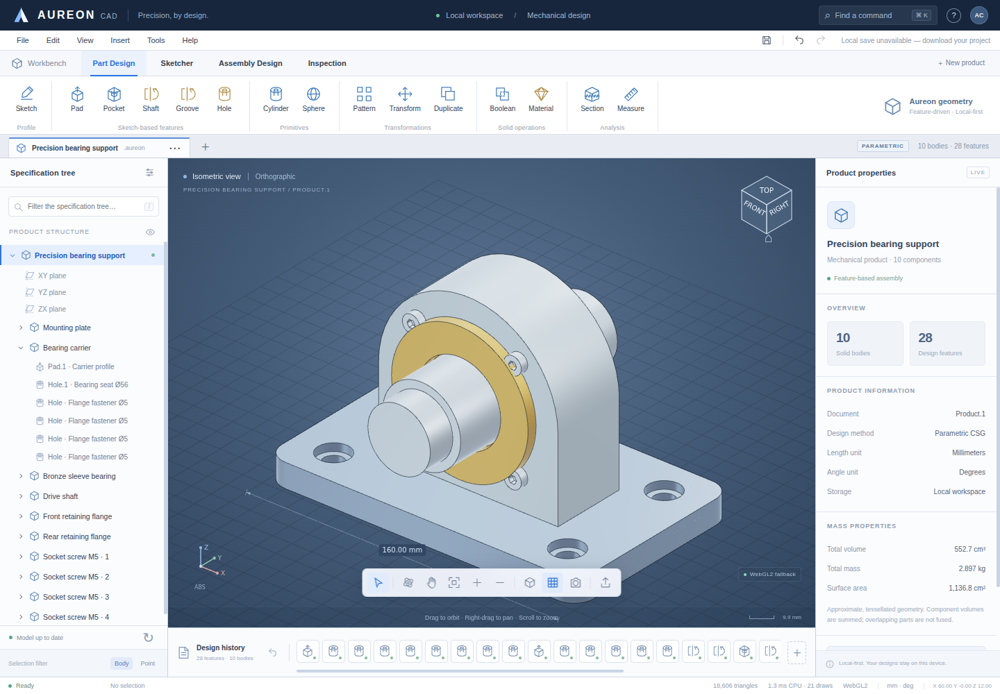

# Aureon CAD

**A framework-free parametric mesh-CAD workbench with native WebGPU and WebGL2 renderers.**

Aureon is an original, CATIA-inspired desktop-style modeling application implemented in plain HTML, CSS, JavaScript, WGSL, and GLSL. It includes a real polygonal constructive-solid-geometry kernel, a replayable feature history, a worker-based evaluation pipeline, and a fully modeled bearing-support example. The example is generated from 28 editable features across 10 bodies, not loaded as a decorative image or pre-rendered mesh.

This is an operational implementation of the features described below—not a complete replacement for CATIA, an exact engineering B-rep kernel, or manufacturing-qualified software. No Dassault Systèmes source code, logos, or product assets are included. The names and workbench organization are references to established CAD workflows; the visual identity and implementation are original.



## Run

There are **no runtime dependencies, package-install steps, build servers, CDN assets, or service accounts**.

### Modular source (recommended for development)

From this directory:

```sh
python3 -m http.server 8080
```

Open `http://localhost:8080` in your browser. `npm start` invokes the same command. Serve through localhost or HTTPS for WebGPU; the browser must expose `navigator.gpu` and provide a compatible adapter. The engine badge shows the actual active backend. If initialization fails or WebGPU is unavailable, the application attempts WebGL2. To force that backend for comparison, append `?renderer=webgl` to the URL.

### Single-file edition

`dist/AureonCAD.html` contains the same application, inline styles, inline scripts, and a Blob-backed geometry worker. It has no external asset requests. A local HTTP server is still recommended: direct `file:` opening has browser-dependent GPU, worker, and local-storage restrictions.

```sh
cd dist
python3 -m http.server 8080
```

Open `http://localhost:8080/AureonCAD.html`.

## Working features

| Area | Implemented behavior |
|---|---|
| Part Design | Pad/extrude, pocket, cylindrical hole, cylinder, sphere, shaft/revolve, revolved groove, linear and circular feature patterns, union/subtract/intersect between bodies. |
| Geometry | Closed-profile extrusion including concave polygons; rounded-rectangle profiles; sampled surfaces of revolution; polygonal BSP booleans; crease-edge extraction; mesh-derived area, volume, centroid, and bounds. |
| Sketcher | Rectangle, circle, and single closed polygon; mouse drawing; 1 mm snapping; Shift square/orthogonal input; numeric profile dimensions; editing an existing Pad/Pocket profile. |
| Parametric editing | Editable numeric feature definitions, live geometry previews, cancellation, suppression, dependency replay, undo/redo, dependency validation, and reference-aware duplication/deletion. |
| Assembly Design | Multiple bodies, rigid translation/rotation, multi-selection, visibility, materials, duplication, and presentation-only exploded placement. |
| Inspection | Actual triangle-ray picking, point-to-point surface measurement, local bounding dimensions, approximate mass properties, and movable axis-aligned section clipping. |
| Viewport | Native WebGPU pipelines; 4× MSAA on WebGPU; depth testing; GGX-based studio shading; analytic environment reflection; crease edges; orthographic/perspective cameras; orbit/pan/zoom; four display modes. |
| Workbench | Searchable specification tree, context menus, property inspector, feature timeline, four workbench tabs, view cube, command palette, and keyboard shortcuts. |
| Persistence | Editable `.aureon.json` project files; restore/debounced autosave in localStorage where permitted; explicit storage-failure notification. |
| Interchange | Binary/ASCII STL import; binary STL and OBJ export; PNG viewport capture; CSV bill of materials; three-view SVG wireframe projections. |

The default document is **Precision bearing support**: a mounting plate with through holes and counterbores, bearing carrier, bronze sleeve, stepped spindle with keyway, retaining flanges, and four socket-head fasteners with actual hexagonal recesses. The current tessellation contains 18,606 triangles.

## Try the modeling workflow

1. Choose **New product**, then **Pad**. Set width, depth, corner radius, and length. Toggle live preview, then create the feature.
2. Select the solid and choose **Hole**. Numeric placement is body-local. A picked surface suggests the dominant local hole axis; the default length spans the body.
3. Select a feature in the specification tree. Edit its dimensions in the inspector or double-click it to open the complete definition. Undo and redo replay the model.
4. Use **Sketcher** to draw a rectangle, circle, or closed polygon, then **Pad sketch**. A selected Pad or Pocket also offers **Edit sketch**.
5. Create a second body and choose **Boolean** on the target body. Pick the tool and operation. The tool remains a parametric reference and can be hidden rather than deleted.
6. Save the editable project. STL and OBJ are tessellated geometry exports, not substitutes for the project history.

Feature dialogs operate in body-local coordinates. Body transforms are millimeters and degrees, with `T · Rz · Ry · Rx` matrix composition. The **new body** checkbox determines whether an additive feature starts a body or unions with the active body. Feature patterns reference an earlier feature and preserve whether it adds or removes material. Exploded placement is a view effect; exports use the actual, unexploded body transforms.

## Navigation and shortcuts

| Action | Input |
|---|---|
| Orbit | Left-drag in viewport |
| Pan | Right/middle-drag, or Shift-drag |
| Zoom | Mouse wheel |
| Pick body / multiple bodies | Click / Ctrl or Command-click |
| Fit all | `F` |
| Isometric / front / top / right | `0` / `1` / `2` / `3` |
| Projection / grid | `P` / `G` |
| Sketch / hole / transform | `S` / `H` / `T` |
| Measure / section / explode | `M` / `C` / `E` |
| Hide selection / delete selection | Space / Delete |
| Undo / redo | Ctrl/Command-Z / Ctrl/Command-Shift-Z |
| Duplicate / save / open / new | Ctrl/Command-D / S / O / N |
| Command palette | Ctrl/Command-K |
| Close polygon | Enter or click first vertex |
| Cancel sketch | Escape |
| Help | `?` |

## Architecture

```text
DOM workbench ── commands / numeric edits / sketches ──> immutable document history
                                                         │
                                                         ▼
                                                  versioned worker request
                                                         │
                                      validate → feature replay → polygonal CSG
                                                         │
                                        tessellation / creases / mass properties
                                                         │
                                             transferable Float32Array buffers
                                                         ▼
                                        retained GPU resources + local-space BVH
                                                         │
                                           WebGPU or WebGL2 viewport renderer
```

| File | Responsibility |
|---|---|
| `src/math.js` | Vector/matrix operations, Z-up camera, projection/unprojection, ray tests, triangle BVH. |
| `src/kernel.js` | Original polygonal BSP kernel, profile validation, primitives, CSG, tessellation, crease extraction, mesh statistics. |
| `src/model.js` | Project schema, feature/body constructors, materials, example model, bounded snapshot history. |
| `src/evaluate.js` | Ordered feature evaluation, per-body prefix caching, linked-body transforms, cycle detection. |
| `src/worker.js` | Geometry worker protocol and transferable result buffers. |
| `src/renderer.js` | Native WGSL/WebGPU and GLSL/WebGL2 implementations; depth, materials, view modes, clipping, selection and resource lifetime. |
| `src/sketch.js` | Canvas2D profile input and display. |
| `src/io.js` | Project, STL, OBJ, SVG, PNG-support downloads, and BOM serialization. |
| `src/app.js` | UI commands, preview/commit transactions, worker bridge, selection, inspector and workbench coordination. |
| `src/icons.js` | Original inline SVG icon definitions. |
| `scripts/build-single.mjs` | Dependency-free, deterministic single-file assembly for this module layout. |

Geometry operates on JavaScript numbers with a fixed BSP split tolerance of `1e-5` model units. Rendering buffers and matrices use Float32Array. This is not an exact-predicate geometry implementation. Rigid transforms avoid the need for a general inverse-transpose normal matrix.

Worker results carry request identifiers. Stale results cannot replace a newer viewport model. Prefix caches retain evaluated solids until the changed feature and replay only the affected suffix. GPU resources are retained for unchanged geometry signatures; camera moves and material changes do not require fresh tessellation. Rendering is invalidation-driven rather than an unconditional animation loop. The displayed frame time measures **CPU command submission/encoding work**, not GPU elapsed time or end-to-end latency.

Picking transforms the world ray into each visible body's local coordinates, traverses a triangle BVH, respects the section plane, and returns the nearest visible hit. Current selection is body/feature selection; it is not a persistent topological face/edge naming system.

## Data, limits, and deployment

The JSON format is `{ format: "aureon-cad", version: 1, units: "mm", bodies: [...] }`, with stable body and feature IDs, ordered features, materials, visibility, and rigid transforms. Sketch profiles are stored on their Pad/Pocket feature. There is no arbitrary script execution in the project format. Imported project names are escaped before insertion into HTML, SVG, and CSV.

Input limits currently include 250 bodies, 2,000 features, 32 MiB import files, 200,000 imported triangles, 512 profile vertices, 256 angular segments, and 64 pattern instances. These are defensive bounds, **not performance guarantees**. BSP operations can still be expensive or numerically unstable on pathological or large imported meshes. A 30-second worker timeout terminates and recreates the worker rather than allowing an indefinitely blocked operation.

History is bounded to 70 commands and approximately 32 million stored UTF-16 code units across retained snapshots, while always retaining at least one command. LocalStorage quota is browser-defined and can be much lower; large projects should be downloaded explicitly. One current project is autosaved, not an unlimited project library.

The modular site can be hosted as ordinary static files. Serve `.js` with a JavaScript MIME type. A restrictive Content Security Policy needs a worker policy compatible with the chosen build: the modular edition uses a module worker; the standalone edition needs inline scripts/styles and `worker-src blob:`. The application does not require cross-origin isolation or SharedArrayBuffer. Do not add analytics or remote scripts to a sensitive local design workspace without reviewing the privacy implications.

## Tests and build

Node.js 20 or later is used only for tests and the optional standalone build:

```sh
npm test
npm run build
```

The Node suite contains **31 tests**, including analytic/polyhedral volumes, revolution caps, profile rejection, Boolean operations, cache invalidation, linked transforms, cycle rejection, undo/redo, picking, camera unprojection, STL round-trip, exporters, and the complete example.

Optional browser tests use Python Playwright, which is a development-only dependency:

```sh
python3 -m pip install playwright
python3 -m playwright install chromium
# Start the local HTTP server in another terminal first.
python3 tests/browser_smoke.py --url http://localhost:8080
```

`--browser /path/to/chromium` selects an existing browser. `--headed` enables a visible browser. `--software` requests Chromium software adapters for controlled testing; these flags are for tests, not normal application usage. `--standalone` injects the built file into an opaque about:blank document, which intentionally cannot establish normal secure-context WebGPU/localStorage behavior.

See `docs/VERIFICATION.md` and the machine-readable reports for exactly what was tested in this delivery. The native WebGPU path is implemented but was **not executed in the restricted test browser**. Actual rendered browser workflows were exercised through WebGL2 on SwiftShader. Hardware performance, cross-browser behavior, and manufacturing suitability are not claimed.

## Deliberate scope boundaries

- **Tessellated solids, not exact B-rep:** no analytic topological kernel, NURBS surface editor, exact geometric predicates, persistent face naming, general fillet/chamfer, shell, loft, sweep, healing, or STEP/IGES/CATPart/CATProduct import/export. Rounded rectangle corners are profile geometry, not a general edge-fillet implementation.
- **Basic sketch profiles, not a constraint solver:** one closed loop; no holes inside an individual sketch, driving-constraint graph, tangency/coincidence solver, spline editor, or general multi-plane face-attached sketch system. Holes and pockets can remove material after extrusion.
- **Body placement, not assembly kinematics:** no mates, collision solver, joints, motion studies, PLM, or collaborative editing.
- **Approximate inspection:** mesh-derived volume, area and mass; component volumes are summed without resolving overlaps. Density presets are illustrative engineering values, not certified material data. Imported STL is not checked or repaired for watertightness, manifoldness, or consistent orientation.
- **Display section, not sectional topology:** clipping discards fragments and does not generate section caps. X-ray uses conventional alpha blending, not order-independent transparency.
- **Projection export, not drafting:** SVG exports display wireframe edges in three views; hidden lines are not removed, and no associative drawing/annotation or GD&T subsystem is provided.
- **Studio rasterization, not a path tracer:** no ray-traced shadows, screen-space ambient occlusion, HDR environment texture, or offline renderer.

Use the implementation as an inspectable, tested starting point for a larger CAD engine; independently validate exported geometry before manufacturing or safety-critical use.

## References

Official workflow and graphics API references are recorded in `docs/SOURCES.md`. Aureon is not affiliated with or endorsed by Dassault Systèmes. CATIA is referenced solely to identify the workflow inspiration.

## License

Original application code and assets are provided under the MIT License; see `LICENSE`.
